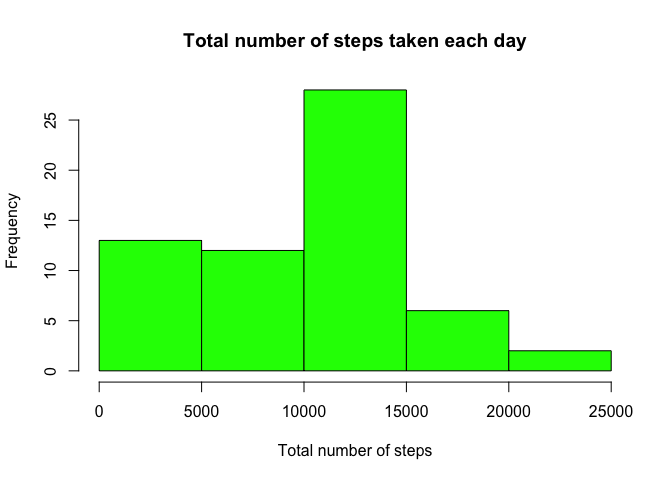
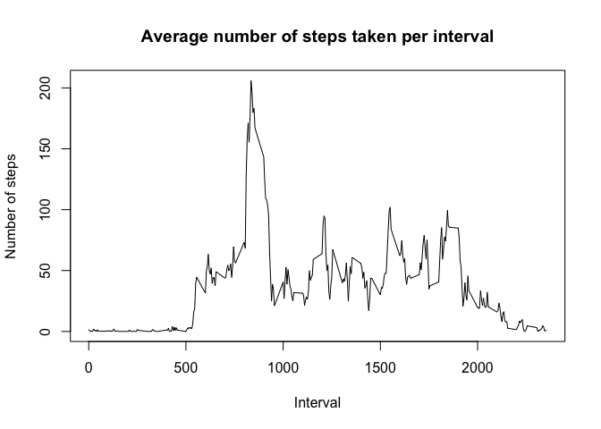
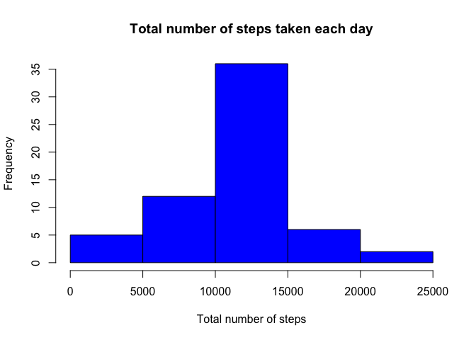

# Reproducible Research: Peer Assessment 1
Magdalena Grzmiel  
June 18, 2016  

# Introduction
This report presents an analysis of data coming from activity monitoring devices. 
This device collects data at 5 minute intervals through out the day. The data consists of two months of data from an anonymous individual collected during the months of October and November, 2012 and include the number of steps taken in 5 minute intervals each day.
This report contains code which allows to reproduce all steps of the analysis in order to received presented results. 

# Analysis
## Loading and preprocessing the data

The first step of the analysis is to load all the libraries which will be used in analysis.
Next read and processsed the data.

```r
library(data.table)
# set working directory
setwd("/Users/magda/Desktop/Coursera/course5 reproducable research/RepData_PeerAssessment1")
# download data from web
url<-"https://d396qusza40orc.cloudfront.net/repdata%2Fdata%2Factivity.zip"
download.file(url, dest="dataset.zip", mode="wb") 
# get the file name
file_name <-unzip ("dataset.zip", exdir = "./")
data<-read.csv(file_name)
# convert to data table
data.dt <- data.table(data)
# processsed the data to the right data format
data$date <- as.Date(data$date)
data$steps <- as.double(data$steps)
data$interval <- as.numeric(data$interval)
```

## What is mean total number of steps taken per day?

First caclulate the number of total steps per day

```r
steps_per_day<-data.dt[ ,list(steps_total=sum(steps, na.rm = TRUE)), by='date']
```

Then, draw a histogram of the total number of steps taken each day

```r
hist(steps_per_day$steps_total, xlab='Total number of steps', 
     main='Total number of steps taken each day', col="green")
```

\

Finally, calculate the mean and median of the total number of steps taken per day

```r
mean_steps_per_day<-mean(steps_per_day$steps_total, na.rm = TRUE)
median_steps_per_day<-median(steps_per_day$steps_total, na.rm = TRUE)
```


```r
mean_steps_per_day
```

```
## [1] 9354.23
```

```r
median_steps_per_day
```

```
## [1] 10395
```

The mean number of steps per day is 9354.2295082.
The median number of steps per day is 10395.

## What is the average daily activity pattern?

First, calculate the average number of steps per interval.

```r
steps_per_interval<-data.dt[,list(avg_steps_per_interval=mean(steps, na.rm = TRUE)), by='interval']
```

Then draw a plot of average number of steps taken per interval.

```r
plot(x=steps_per_interval$interval, y=steps_per_interval$avg_steps_per_interval,
     type="l", main="Average number of steps taken per interval", 
     xlab="Interval", ylab="Number of steps")
```

\

Calculate which interval contains the maximum number of steps.
To calculate this first get what is the maximum number of steps:

```r
max_steps<-max(steps_per_interval$avg_steps_per_interval)
```
Then get which interval has to maximum number of steps.

```r
interval_with_max<-subset(steps_per_interval, avg_steps_per_interval == max_steps)
int_max <- interval_with_max$interval
int_max
```

```
## [1] 835
```
The 835 conatins the maximum number of steps per interval.

## Imputing missing values
First, calculate and report the total number of missing values in the dataset.

```r
missing_values <- nrow(na.omit(data.dt))
missing_values
```

```
## [1] 15264
```
The number of missing values in the dataset is 15264.

Then fill all of the missing values in the dataset by using the values of median number of steps for each 5-minute interval.


```r
replace_na <- function(x) {
        dt <-copy(x)
        dt$date <- as.Date(data$date)
        dt$steps <- as.double(data$steps)
        dt$interval <- as.numeric(data$interval)
        
        spi<- dt[,list(avg_steps_per_interval=mean(steps, na.rm = TRUE)), by='interval']
        for (i in 1:nrow(dt)) {
                if (dt[i,is.na(steps)]){
                        dt[i, steps:=spi[interval==data.dt[i, interval], 
                                                             avg_steps_per_interval]]
               }
        }

        return (dt)
}

# Create a new dataset that is equal to the original dataset but with the missing data filled in.
data_no_na <- replace_na(data.dt)
```

Then calculate the total number of steps taken each day and draw the histogram.


```r
steps_per_day_no_na<-data_no_na[,list(steps_total=sum(steps)), by='date']
hist(steps_per_day_no_na$steps_total, xlab='Total number of steps', 
     main='Total number of steps taken each day', col="blue")
```

\

Calculate the mean and median total number of steps taken per day. 

```r
mean_steps_per_day_no_na<-mean(steps_per_day_no_na$steps_total, na.rm = TRUE)
mean_steps_per_day_no_na
```

```
## [1] 10766.19
```

```r
median_steps_per_day_no_na<-median(steps_per_day_no_na$steps_total, na.rm = TRUE)
median_steps_per_day_no_na
```

```
## [1] 10766.19
```

The mean of total number of steps taken per day is 1.0766189\times 10^{4}.
The median of total number of steps taken per day is 1.0766189\times 10^{4}.

Filling the missing values coused that the mean and median of total number of steps taken per day increased.

## Are there differences in activity patterns between weekdays and weekends?

First, add a new factor variable in the dataset indiacting whether a given date is a weekday or weekend day.

```r
# indicating whether a given date is a weekday or weekend day.
data.dt$day <- weekdays(as.Date(data.dt$date))
data.dt[day != "Saturday" && day !="Sunday", day_of_week:="weekday"]
data.dt[(day == "Saturday"), day_of_week:="weekend"]
data.dt[(day == "Sunday"), day_of_week:="weekend"]
```

Then, calculate the average number of steps taken during the weekdays and weekends per each interval.

```r
steps_per_intr_weekdays<-data.dt[,list(avg_steps_per_intr=mean(steps, na.rm = TRUE)), 
                                 by=c("day_of_week", "interval")]
```

Finally, create the plot of 5-minute interval (x-axis) and the average number of steps taken - averaged across all weekday days or weekend days (y-axis).


```r
library ("lattice")
par(mfrow=c(2,1)) 
xyplot(avg_steps_per_intr ~ interval | factor(day_of_week), 
       data=steps_per_intr_weekdays, type="l",  layout = c(1,2), xlab="Interval",
       ylab="Number of steps")
```

\
